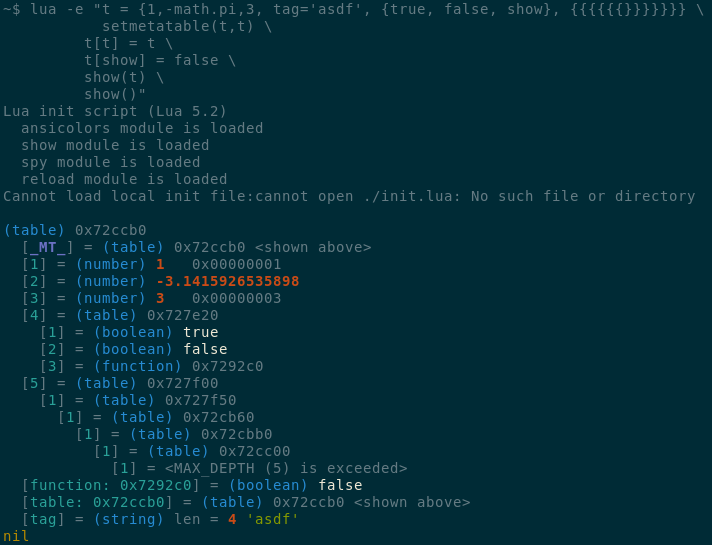

Lua utils
=========

This is a collection of various tools and small scripts to make
life with Lua more comfortable.  At the moment it includes:

 * `init.lua` -- script intended to be used as a value of `LUA_INIT` shell environment variable.  It loads all the other modules and extensions, then it loads file `init.lua` from the current working directory, if the one exists.

 * `show(...)` -- pretty prints its arguments

 * `spy(f [, name])` -- returns function `f` wrapped with code to print call arguments, return values and CPU time used

 * `reload "mod_name"` -- clear `package.loaded` entry and calls `require`

 * `rshow()` -- helper recursive function to print Lua data,  
it is used internally by `show()` and `spy()`  
The function is based on the code by Tobias Sülzenbürck and Christoph Beckmann
from  [Lua Programming Gems](http://www.lua.org/gems/), ISBN 978-85-903798-4-3), pg. 29-32

## Screenshot

## License

This code is released under dual licenses:

 * MIT public license (same as Lua, MIT-LICENSE.txt)

and

 * Community Research and Academic Programming License  
   (because this code is written and used in academic environment,  
   CRAPL-LICENSE.txt)

---

Copyright &copy; 2015 Anton Kuzmin
